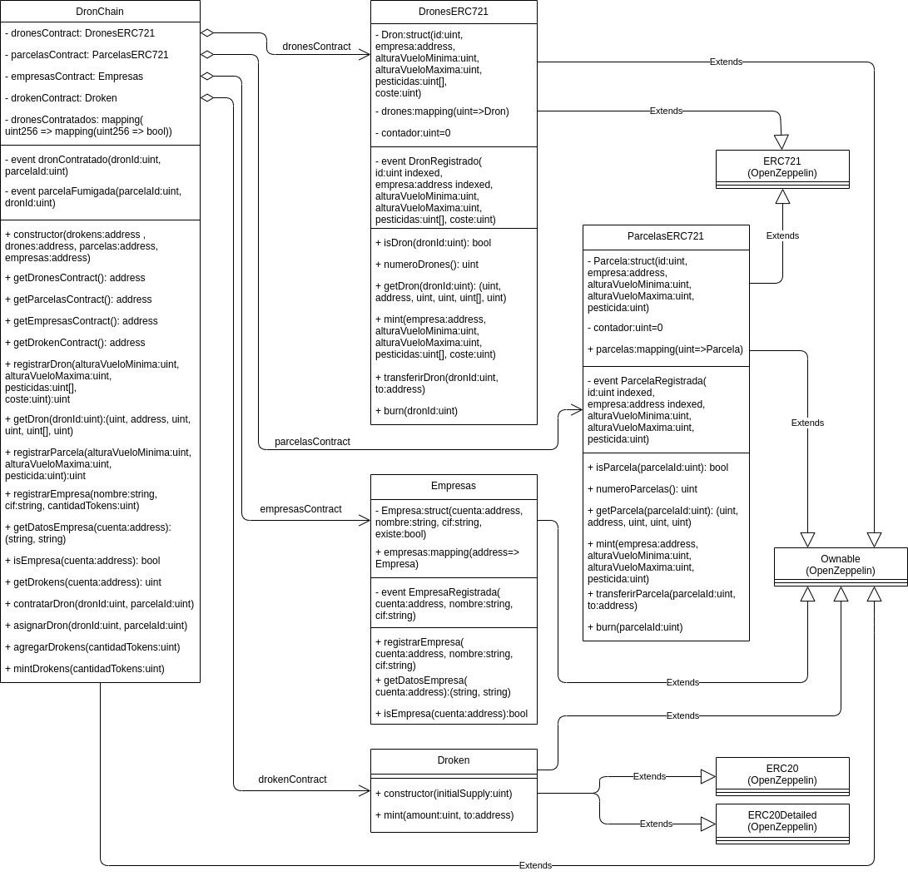

# DronChain

DronChain is a DApp for crop-spraying drone management over the Ethereum blockchain. It allows to register new drones and plots to their owners, to hire an available drone to a plot owner and to approve that hiring to the drone owner.  
This was the final project for the Universitary Expert on Blockchain Application Development of UNIR.

## Description

DronChain uses the ERC721 token standard for modelling the drones and the plots and defines its own ERC20 token as the value exchange unit between the plot owners and the drone owner.  
The contract architecture follows a business-logic/database distinction allowing the persistence of all data registered (drones, plots, users) while the main logic of the application (DronChain.sol) might be upgraded in the future.  
All contracts inherit from the Ownable standard: in the case of the main contract DronChain.sol this owner is the deployer and serves as a protector for the most sensitive functions, but for the rest of the contracts the owner is the instance of DronChain ensuring that all the calls to those contract are made from that istance of the main contract.  
All stardard contracts used in this project are from [OpenZeppelin](https://github.com/OpenZeppelin/openzeppelin-contracts).

### Class diagram


## Getting Started
Deploying and testing the contracts require [Truffle Suite](https://www.trufflesuite.com/) and [Ganache CLI](https://www.npmjs.com/package/ganache-cli).

### Deploying the contracts
Install all the dependencies for the smart contracts:
```
cd smart_contracts
npm install
```
Compile all the smart contracts:
```
truffle compile
```
Build our testnet blockchain with Ganache CLI:
```
ganache-cli -p 7545
```
Migrate the smart contracts to the testnet:
```
truffle migrate --reset
```

### Testing the contracts
Run all the tests (js + Solidity):
```
truffle test
```

## Authors

[oscortiz](https://github.com/oscortiz)  
[ikerp](https://github.com/ikerp)  
[msalitu](https://github.com/msalitu) was the director of this project and many of her suggestions and corrections are included on it.

